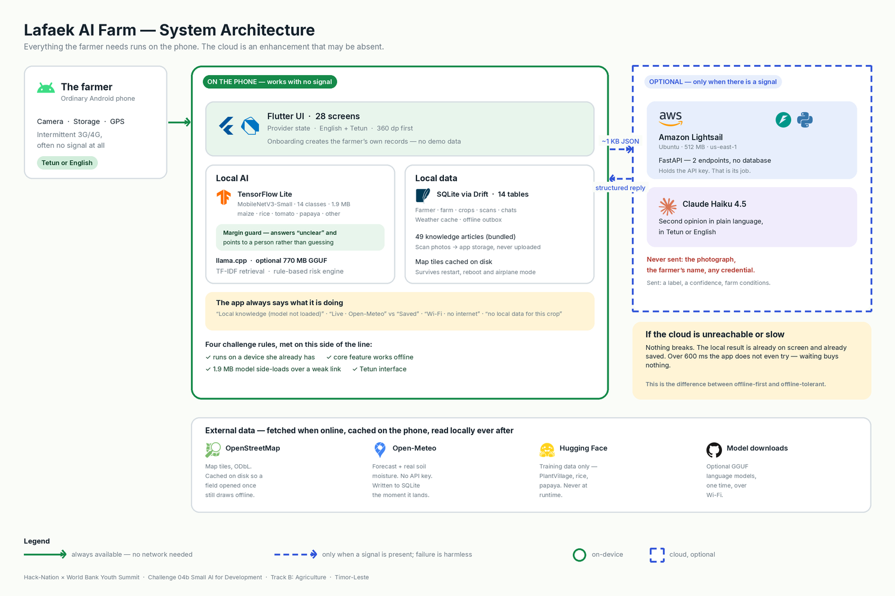
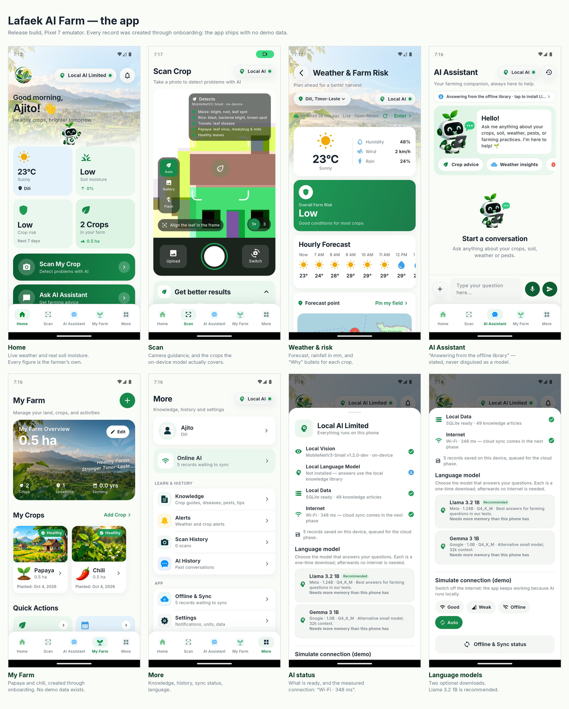

# Lafaek AI Farm

### AI that works where the internet doesn't.

A farming assistant for smallholder farmers in **Timor-Leste**. It identifies
crop problems from a leaf photo, warns about weather risk, and answers farming
questions — on an ordinary Android phone, **with no signal**. When a signal
appears it can ask Claude Haiku for help, but it never needs to.

> **Hack-Nation × World Bank Youth Summit** · Challenge 04b — *Small AI for
> Development* · **Track B: Agriculture**

### ⬇ [Download the Android APK](https://drive.google.com/file/d/134zTtlbgaEjsoSXXJ_4Q6iK-6ZXOaRA-/view?usp=sharing)

Android 8+, arm64. No account, no API key, no signal. **Turn on airplane mode
before you try it** — the offline behaviour is the whole point, and the app
ships with no demo data, so what you see is what it really does.



---

## The problem

> Because of this tool, a smallholder farmer in Timor-Leste will **identify a
> crop problem and act on it the same day**, where they would otherwise wait
> for an extension officer who reaches the sub-county **twice a year at best**
> — and 60% of the country is not online to look it up instead.

Agriculture supports about **70%** of Timor-Leste's population. The UN's 2025
Common Country Analysis reports only **39.5%** internet use, concentrated in
towns. A tool that needs a connection is a tool most farmers cannot use.

---

## What it does



| | |
|---|---|
| 📷 **Scan a leaf** | 14 classes on the phone: maize, rice, tomato, **papaya** — and "that is not a leaf" |
| 🤔 **Say "I don't know"** | When two classes are close it refuses to guess and points to an extension officer |
| ☁️ **Ask Claude when stuck** | If the phone cannot place the leaf, the photo goes to Claude Haiku's vision — only on a link measured under 600 ms |
| 🌦️ **Weather + risk** | Live forecast with real soil moisture; transparent rules say *why* a crop is at risk |
| 💬 **Ask a question** | 49 offline articles → on-device language model → Claude, in that order |
| 🗺️ **Pin your field** | OpenStreetMap, tiles cached for offline use; the forecast follows your plot |
| 🇹🇱 **Tetun or English** | The whole interface, not a token string |

---

## How it meets the challenge

### The four rules (§06)

| Rule | How |
|---|---|
| Runs on a device the user already has | Ordinary Android phone — camera, storage, intermittent 3G |
| Its core feature works offline | Scanning, records, advice and risk are all on-device |
| Model files small enough to side-load or send over a weak connection | **1.9 MB** vision model, bundled. The optional 770 MB language models are *not* small enough — which is why the app works fully without them |
| At least one interaction in a local language | **Tetun** — named, and the entire interface |

### Responsible AI — the pass/fail criterion

The brief asks for a fail-safe: *"not sure — ask a person" rather than
guessing.* Here that is **code, not a disclaimer**:

```
report a result only if   confidence ≥ 0.55   AND   top1 − top2 ≥ 0.20
otherwise                 "The image is not clear enough …" + ask an extension officer
```

It exists because an early model called a **healthy maize leaf
`rice_bacterial_blight` at 74% confidence**. A confidently wrong answer is
worse for a farmer than no answer.

### Data grounding (§7.2 — *scored*)

The training photographs were taken in the United States, South-East Asia and
Bangladesh — **not Timor-Leste**. PlantVillage is studio imagery on plain
backgrounds, which the brief itself names as a weakness. Every dataset, licence
and gap is in **[docs/DATASETS.md](docs/DATASETS.md)**.

This is not theoretical. The first scan of a real Timorese papaya came back
**unknown at 46%** — the guard working correctly on a field photo with gravel,
shadow and a whole plant in frame. Claude then identified it from the image,
and that reading was saved to the phone.

---

## Evidence

| | |
|---|---|
| Vision model | **95.1%** validation on 14 classes, 1.9 MB, **1.4 s** per photo on device |
| Papaya | **97%** on healthy leaves — the class a farmer tests first on the tree in their yard |
| Held-out check | **158 correct · 7 unclear · 3 wrong** out of 168 |
| Tests | **103 passing**, `flutter analyze` clean |
| Tetun | 12 tests assert every string genuinely differs from English |
| On device | Verified on a CPH2577 (Android 15) and a Pixel 7 emulator, release build |
| Backend | Live on Lightsail; answers in Tetun when asked |

---

## Running it

### Just install it

**[Download the APK](https://drive.google.com/file/d/134zTtlbgaEjsoSXXJ_4Q6iK-6ZXOaRA-/view?usp=sharing)**
on an Android phone (8+, arm64) and allow install from that source. Then:

1. Complete onboarding — name, municipality, farm, field, crop. It saves with
   no signal, because there is no demo data to fall back on.
2. **Turn on airplane mode.** This is the test that matters.
3. Scan a maize, rice, tomato or papaya leaf. Or scan something that is not a
   leaf, and watch it say so.
4. Ask the assistant a question, open **Weather**, switch to **Tetun**, then
   kill the app and reopen it. Everything is still there.
5. Turn the network back on and reopen a scan the phone could not identify —
   Claude's reading appears, and is saved.

### Or build it

```bash
cd "Lafaek AI Farm/mobile-app"
flutter pub get
flutter analyze && flutter test          # 103 tests
flutter build apk --release
adb install -r build/app/outputs/flutter-apk/app-release.apk
```

Requires Flutter 3.47+. **No API key, no account, no `.env`** — the app has no
secrets. The optional language model is downloaded by the farmer from inside
the app. The backend is optional; see
[docs/ONLINE_BACKEND.md](docs/ONLINE_BACKEND.md) to deploy your own.

---

## Documentation

Full documentation is in **[`docs/`](docs/)**. Start with:

| | |
|---|---|
| **[docs/README.md](docs/README.md)** | Index and current state |
| **[docs/ARCHITECTURE.md](docs/ARCHITECTURE.md)** | Eight diagrams — system, application, routing, deployment, data pipeline, sequence, screens |
| **[docs/DATASETS.md](docs/DATASETS.md)** | Every dataset, licence, and what it does not cover |
| **[docs/CROP_COVERAGE.md](docs/CROP_COVERAGE.md)** | Which crops work offline, which need internet |
| **[docs/LOCAL_LANGUAGE.md](docs/LOCAL_LANGUAGE.md)** | Tetun, and how this would fare in a less-supported language |

```
Lafaek AI Farm/mobile-app/   Flutter app — the product
backend/                     FastAPI service that holds the Anthropic key
docs/                        Documentation, diagrams, screenshots
```

---

## Credits

Weather by [Open-Meteo](https://open-meteo.com) (CC BY 4.0) · Map data ©
[OpenStreetMap](https://www.openstreetmap.org/copyright) contributors (ODbL) ·
PlantVillage (CC0) · `minhhungg/rice-disease-dataset` (Apache-2.0) ·
`Project-AgML/papaya_leaf_disease_classification_bangladesh` (CC BY 4.0) ·
Built with Llama · Inter font (SIL OFL 1.1) · llama.cpp (MIT) ·
TensorFlow Lite (Apache-2.0)
