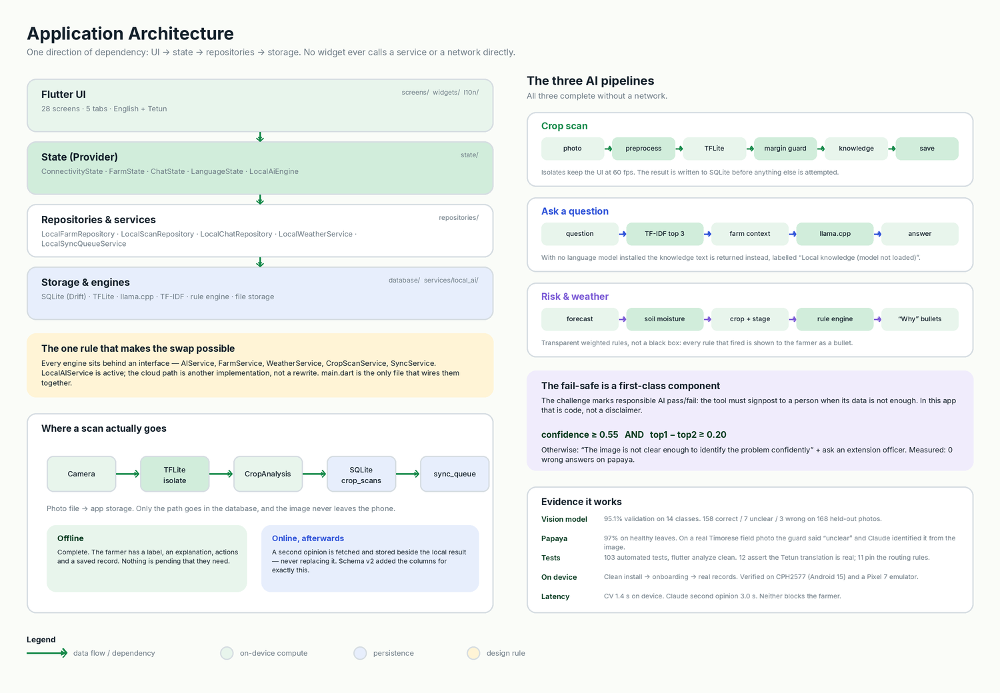
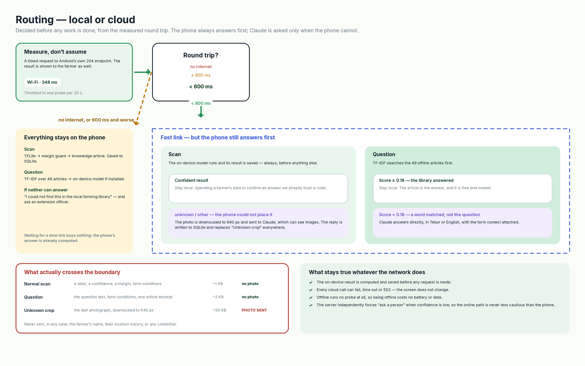
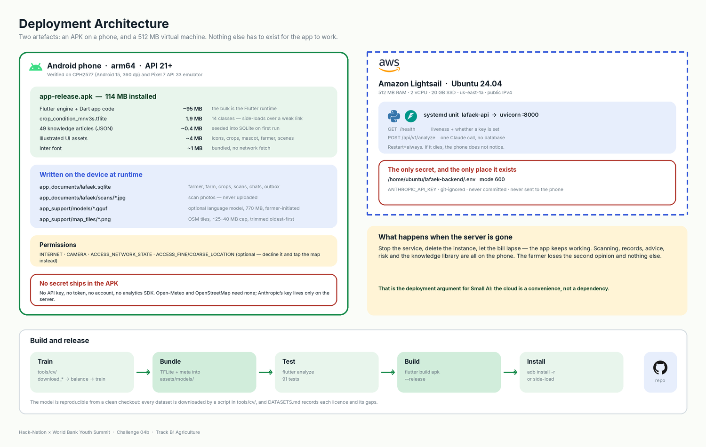
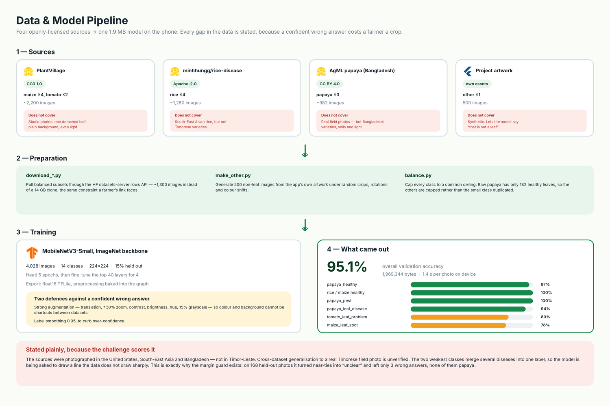
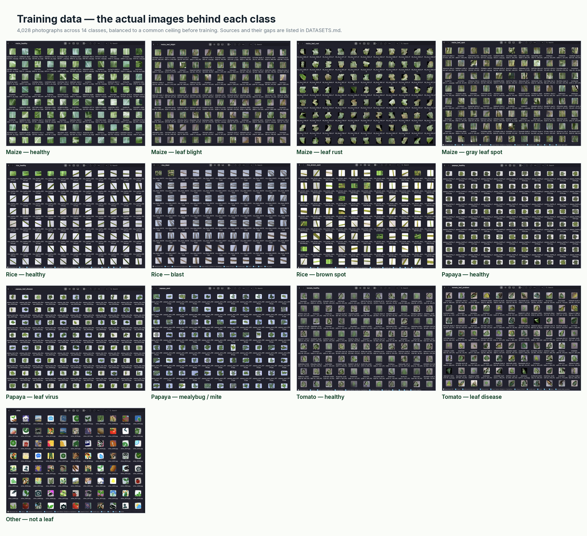
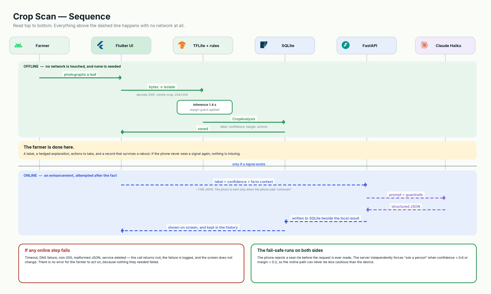

# Architecture

Eight views of the same system, following the diagram types AWS sets out in
[*What is architecture diagramming?*](https://aws.amazon.com/what-is/architecture-diagramming/)
— system, application, routing, deployment, data/ML pipeline, a sequence for
the journey that matters most, the training data, and the app itself.

All diagrams are generated from code in [`diagrams/`](diagrams/), so they can
be regenerated when the system changes rather than drifting out of date.

---

## 1. System architecture

*What the farmer has, what runs on the phone, and what the cloud adds.*


The dividing line is the whole point of the project, so it is drawn literally.
Everything inside the green boundary works with no signal: crop scanning, farm
records, farming advice, risk warnings, the knowledge library, maps and the
last forecast. The blue dashed boundary is optional — delete it and the app
still works.

**Why this matters for the challenge.** §06 requires the core feature to work
offline and the model files to be small enough to send over a weak connection.
The vision model is 1.9 MB and bundled in the APK. The 770 MB language models
are optional precisely because 770 MB is *not* small enough for a weak link —
so the app answers from the knowledge library without them, and says so.

---

## 2. Application architecture

*How the code is organised, and the three AI pipelines.*



One direction of dependency: UI → state → repositories → storage. No widget
calls a service or a network directly. Every engine sits behind an interface,
which is what made the cloud path an addition rather than a rewrite.

The fail-safe is a component, not a disclaimer:

```
report a result only if   confidence ≥ 0.55   AND   top1 − top2 ≥ 0.20
otherwise                 "The image is not clear enough …" + ask a person
```

### What this looks like to the farmer


Note what each screen states rather than hides: *"Answering from the offline
library"*, *"Wi-Fi · 348 ms"*, *"Local AI Limited"* when no language model is
installed, and the crops the model actually covers. The honesty rules in the
README are visible in the product, not just in the documentation.

---

## 2b. Routing — local or cloud

*The decision the app makes before doing any work.*



One measured number drives everything. Under 600 ms the cloud is worth asking;
at 600 ms or worse it is not, because the phone has already computed an answer
and waiting buys nothing. Crucially the phone answers **first** in every case —
Claude is only asked when the phone genuinely could not.

That is also where the one image upload lives: when the on-device model returns
`unknown`, the photo is sent to Claude's vision, because Claude can see images
and the phone cannot place this one. The farmer is told on screen, and the
reply is **written to SQLite** — it replaces "Unknown crop" on the result
screen and in the scan history, and survives closing the app.

---

## 3. Deployment architecture

*What is installed where, how big it is, and where the one secret lives.*



Two artefacts: a 114 MB APK, and a 512 MB virtual machine. The Anthropic API
key exists in exactly one place — `/home/ubuntu/lafaek-backend/.env`, mode 600,
git-ignored. Nothing secret ships in the APK, which is why Open-Meteo and
OpenStreetMap were chosen: neither needs a key.

---

## 4. Data and model pipeline

*Where the training data came from, and what it does not cover.*



Section 7.2 of the challenge says the gaps in your data are **scored**. They
are stated in red on the diagram and in full in [DATASETS.md](DATASETS.md).
The honest summary: the photographs were taken in the United States,
South-East Asia and Bangladesh, not Timor-Leste, so generalisation to a real
Timorese field photo is unverified — which is the reason the margin guard
exists.



---

## 5. Crop scan sequence

*The journey that matters most, drawn so the ordering is unmistakable.*



The farmer is finished before the network is consulted. The local result is
computed, explained and saved first; the online second opinion is attempted
afterwards and stored *beside* it, never replacing it. Every online failure
returns null and changes nothing on screen.

---

## Technology, and why each was chosen

| Layer | Choice | Why this one |
|---|---|---|
| App | **Flutter / Dart** | One codebase, good performance on cheap Android hardware, and a real offline story |
| Database | **SQLite via Drift** | On-device source of truth; type-safe queries; survives reboot |
| Vision | **TensorFlow Lite** + MobileNetV3-Small | Runs on a CPU-only mid-range phone; 1.9 MB after float16 export |
| Language model | **llama.cpp** (`llama_cpp_dart`) | Runs a quantised GGUF on-device with no server. Optional by design |
| Retrieval | **TF-IDF**, hand-written | 49 articles do not need a vector database. < 5 ms, no dependency |
| Risk | **Weighted rules**, hand-written | A farmer can be shown *why*. A model here would be less useful, not more |
| Weather | **Open-Meteo** | No API key, no account, CC-BY data, and real soil moisture |
| Maps | **OpenStreetMap** + `flutter_map` | Open data, tiles cacheable on device for offline use |
| Backend | **FastAPI** on **Amazon Lightsail** | Smallest thing that can hold an API key safely |
| Cloud model | **Claude Haiku 4.5** | Fast and cheap enough for a second opinion; good at structured JSON |

Every one of these is free or open except the Anthropic API, and the app works
fully without that.

---

## Regenerating the diagrams

```bash
cd docs/diagrams
python3 fetch_logos.py        # brand marks from Simple Icons (CC0) + Wikimedia
python3 gen_system.py
python3 gen_application.py
python3 gen_deployment.py
python3 gen_mlpipeline.py
python3 gen_sequence.py
```

Requires `pillow` and `cairosvg`. Logos are reproduced only to identify the
technology in a diagram; each remains the property of its owner.
