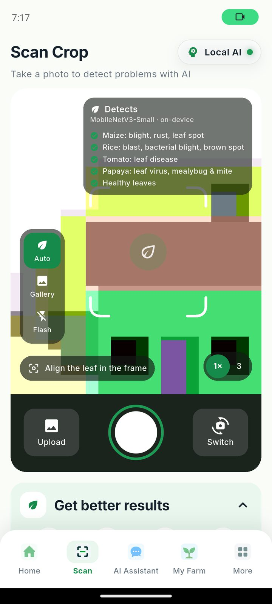

# Crop coverage — what works offline, what needs internet

The app is honest about its own limits. Not every crop is supported the same
way, and the farmer is told which is which **before** they walk into a field
with no signal.

There are three levels.

| Level | What it means | Needs a signal? |
|---|---|---|
| **Local leaf scan** | The bundled vision model has classes for this crop. A photo is analysed on the phone. Knowledge articles and risk rules are also local. | No |
| **Local advice** | Knowledge articles and risk rules are on the phone, but the vision model has no classes for the crop. Advice and risk work offline; photo analysis does not. | No, except for scanning |
| **Online only** | Nothing about this crop is on the phone. The record is saved locally, but advice comes from Claude Haiku through the backend. | Yes |

## Where each crop sits

### Local leaf scan — trained into the model

**Maize · Rice · Tomato · Papaya (pawpaw)**

These four are what the on-device model was trained on. Papaya was added
because it grows in most Timorese house yards, so a farmer can test the app on
a plant they already have rather than taking the claim on trust.

| Crop | Classes in the model |
|---|---|
| Maize | healthy, leaf blight, leaf rust, gray leaf spot |
| Rice | healthy, blast, bacterial leaf blight, brown spot |
| Tomato | healthy, leaf problem (early blight, late blight, Septoria merged) |
| Papaya | healthy, leaf virus (curl/mosaic/ring spot), pest (mealybug/mite) |

Measured on a 15% held-out split: **95.1% overall**, with `papaya_healthy` at
**97%** — the class that matters for testing on a pawpaw at home.

Plus `other`, for photos that are not a leaf at all.

### Local advice — knowledge and risk, no scan

**Chili · Beans · Cassava**

These have knowledge articles and risk rules on the phone, so the assistant and
the weather risk engine work with no signal. The camera cannot classify them:
pointing it at a chilli leaf gives `other` or an unclear result, which is the
correct answer rather than a guess.

### Online only

**Coffee · Coconut · Banana · Sweet potato · Potato · Onion · Cabbage · Water
spinach · Peanut · Mango · Citrus · Taro**

The farmer can record these crops, track area and log activities offline —
that is all local database work. What needs a connection is the *advice*,
which comes from Claude Haiku. The Add Crop screen greys these out when the
phone is offline and says why.

## What the farmer sees



The Scan screen lists exactly what the bundled model detects — maize, rice,
tomato and papaya — so the farmer is never guessing at coverage.


In **Add Crop** the list is split into two groups with plain labels:

```
Add Crop · Works without internet
  [ Maize ] [ Rice ] [ Tomato ] [ Papaya ] [ Chili ] [ Beans ] [ Cassava ]

Needs internet
  [ Coffee ] [ Coconut ] [ Banana ] [ Sweet potato ] …
```

Offline, the second group is greyed out and a line reads:

> You are offline, so these crops cannot be analysed right now. They will work
> when you have a signal.

Selecting a crop explains what the app can do for it:

* **Papaya** — "The camera can check Papaya leaves for disease."
* **Chili** — "For Chili the app gives advice and risk warnings. Leaf scanning
  covers maize, rice, tomato and papaya."
* **Coffee** — "The app has no local data for Coffee yet. You can still record
  it, and ask for advice while you have a connection."

All three sentences exist in Tetun as well.

## Why it is built this way

A tool that silently does nothing in a field is worse than one that says what
it cannot do. The challenge brief makes this explicit — the pass/fail criterion
asks for a fail-safe that signposts to a human when the data is not enough,
rather than guessing.

The same principle runs through the whole app:

* the vision model answers *unclear* when two classes are close, instead of
  picking one (the margin guard in [ENGINEERING.md](ENGINEERING.md));
* the weather screen says whether the forecast is live or saved, and how old;
* the assistant labels answers "Local knowledge (model not loaded)" when no
  language model is installed;
* and the crop list says which crops it cannot help with offline.

## Adding a crop to the local model

Adding a crop is a **data task, not a code change** — the app reads its class
list from `assets/models/model_meta.json` at runtime.

1. Add a downloader under `mobile-app/tools/cv/` (see `download_papaya.py` as
   the template) with a permissively licensed source.
2. Write the knowledge articles in `assets/data/agriculture/diseases.json` and
   bump `LocalKnowledgeService.seedVersion`.
3. Map the new class ids in `local_ai_orchestrator.dart` — `_articleIdFor` for
   the article, `_hedgedLabel` for the wording.
4. Move the crop from `onlineOnlyCrops` to `localScanCrops` in
   `lib/core/crop_catalogue.dart`.
5. Re-run `balance.py` and `train.py`.
6. Record the dataset, its licence and **what it does not cover** in
   [DATASETS.md](DATASETS.md).

Step 6 is not optional. The challenge scores it, and it is the difference
between a model a farmer can trust and one that is confidently wrong.
